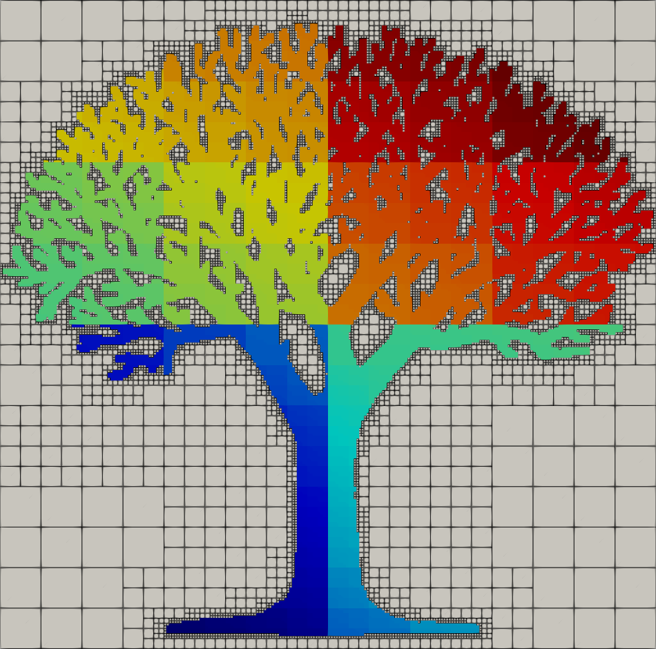

# DGTile
> A portably performant discontinuous Galerkin adaptive mesh library

## What is this?

DGTile is a C++17 adaptive mesh library meant to support explicit
discontinuous Galerkin finite element applications on high performance
computing machines.

## Dependencies

DGTile has required dependencies on:

  * [fmt](https://github.com/fmtlib/fmt) - string formatting
  * [kokkos](https://github.com/kokkos/kokkos) - shared memory parallelism
  * [googletest](https://github.com/google/googletest) - testing
  * [lua](https://gitlab.com/codelibre/lua/lua-cmake) - interfacing
  * [mpi](https://www.open-mpi.org/) - distributed memory parallelism
  * [mpicpp](https://github.com/sandialabs/mpicpp) - MPI C++ interfacing
  * [zlib](https://github.com/zlib-ng/zlib-ng) - data compression

##

At Sandia, DGTile is SCR 2806.0
