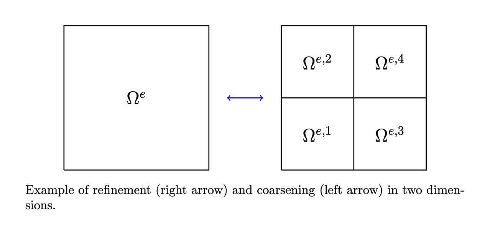

=================
Solution Transfer
=================

------------
Introduction
------------

When a single block is *refined*, :math:`2^d` child blocks are created and
it is necessary to *prolong* solution information from the cells in the
original block to the cells in the newly created finer blocks.
Conversely, when :math:`2^d` blocks that share a single parent are *coarsened*,
it is necessary to *restrict* the solution from the cells in the original
blocks to the remaining coarse block. The figure below illustrates the concept
of a sinlge cell being split into :math:`n_s = 2^d` child cells, denoted
by :math:`\Omega^{e,s}`.

------------
Prolongation
------------

To prolong the solution state from a coarse cell :math:`\Omega^e` to a fine
cell :math:`\Omega^{e,s}`, we perform an :math:`L^2` projection of the
original solution :math:`\boldsymbol{U}^e` onto the modal basis on the
finer cell, so that

.. math::

  \left( u^{e,s}(\boldsymbol{x}, t), \phi_b(\boldsymbol{x}) \right)_{\Omega^{e,s}} =
  \left( u^e(\boldsymbol{x}, t), \phi_b(\boldsymbol{x}) \right)_{\Omega^{e,s}},
  \quad b=1,2,\dots,n_b.

.. math::

  \int_{\Omega^R} u^{e,s}(\boldsymbol{\xi}, t) \phi_b(\boldsymbol{\xi}) \,
  \mathcal{J}^e \, \text{d} \Omega &=
  \int_{\Omega^R} u^e(\hat{\boldsymbol{\xi}}^s, t) \phi_b(\boldsymbol{\xi}) \,
  \mathcal{J}^e \, \text{d} \Omega, \\
  \sum_{i=1}^{n_b} c^{e,s}_i(t)
  \int_{\Omega^R} \phi_i(\boldsymbol{\xi}) \phi_b(\boldsymbol{\xi}) \, \text{d} \Omega &=
  \sum_{a=1}^{n_b} c^e_a(t)
  \int_{\Omega^R} \phi_a(\hat{\boldsymbol{\xi}}^s) \phi_b(\boldsymbol{\xi}) \, \text{d} \Omega, \\
  c^{e,s}_b(t) &=
  \frac{1}{M_b} \sum_{a=1}^{n_b} c^e_a(t)
  \int_{\Omega^R} \phi_a(\hat{\boldsymbol{\xi}}^s) \phi_b(\boldsymbol{\xi}) \, \text{d} \Omega, \\
  c^{e,s}_b(t) &=
  \frac{1}{M_b} [\boldsymbol{\mathcal{P}}^s]^T \boldsymbol{c}^e(t).

In the first equality, the original solution :math:`u^e` is evaluated at
*shifted* reference points :math:`\hat{\boldsymbol{\xi}}^s` so that
the solution :math:`u^e(\hat{\boldsymbol{\xi}}, t)` in the original cell
is evaluated at the same reference locations as the prolonged solution
:math:`u^{e,s}(\boldsymbol{\xi}, t)` in the current subcell. In the
second equality, the Jacobian determinants have cancelled as they are
constant over axis aligned cells and the definition of the solution
representation has been used on both sides of the equality. The
orthogonality of the basis functions has been used in the third equality.

.. note::

  The prolongation operation is *exact* in that it exactly preserves the
  original solution distribution within each refined cell

.. note::

  Because refinement occurs at the *block* level, rather than at individual
  cells, it is also necessary to map parent cells in the original block
  to child cells in each refined block. To facilitate the ease of this
  mapping, we require that the number of cells along each axis (in a block)
  is divisible by 2 for meshes that make use of AMR.
