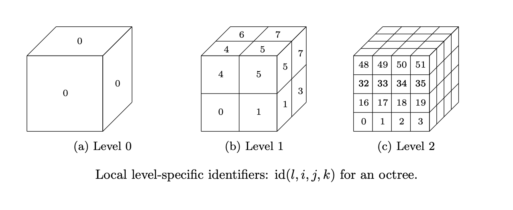
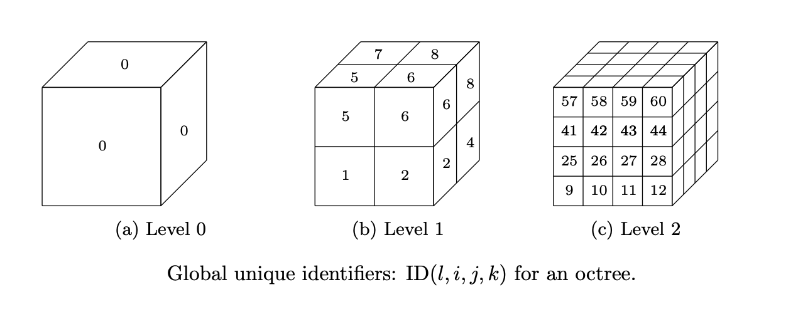
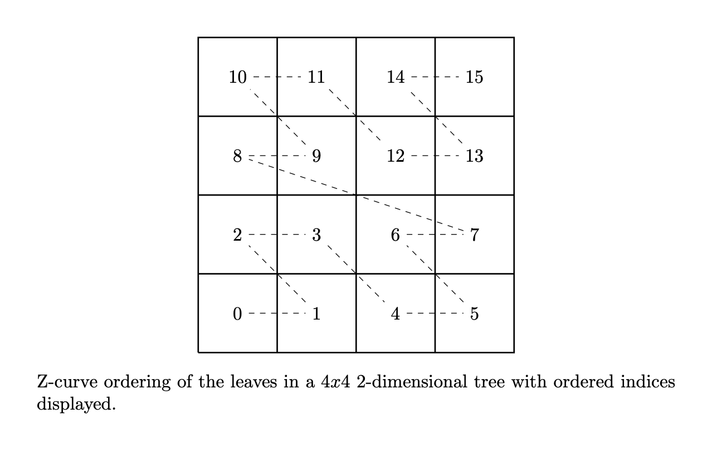

=====
Trees
=====

------------
Introduction
------------

A *tree* is an abstract hierarchical data type that connects *nodes*
via *edges*. Each node in a tree is connected to a single *parent node*
with the exception of the *root node*, which has no parent.
Additionally, each node may be connected to multiple *child nodes*.
In DGTile, we use a *binary tree*, a *quadtree*, and an
*octree* to enable mesh adaptivity in one, two, and three spatial
dimensions, respectively. In a binary tree, quadtree, and octree each
*internal node* is connected to exactly two, four, and eight *child nodes*,
respectively. In contrast, a *leaf node* is any node in the tree that contains
no children. The *level* of a node in the tree is its distance away from
the rood node, where the *distance* is the number of edges along the
shortest path between two nodes. The root node in a tree has a level of 0.

--------------------------------------
Uniquely Identifying Nodes in the Tree
--------------------------------------

For the purposes of identifying, storing, modifying, and computing adjacencies
of leaves in the tree, it is useful to assign unique identifiers to every
possible node in the tree at every possible level. These identifiers are
computed using simple integer arithmetic. At every potential level :math:`l` in
the octree, we can assign a level-specific identifier :math:`\text{id}(l,i,j,k)`
to a potential node in the tree given the node's ijk Cartesian grid location
at that level. Presently, we consider the following choice for the
level-specific identifier

.. math::
  \text{id}(l,i,j,k) = i + 2^l(j + k 2^l)

where identifiers are strided the quickest along the x-axis and slowest
along the z-axis. Note that for a two-dimensional quadtree k will always
be 0 and likewise, for a one-dimensional binary tree k and j will always
be 0.

The figure above illustrates level-specific identifiers
for levels :math:`l=0,1,2` for an octree, where the x-axis extends from the
left to right of the page, the y-axis extends from out to into the page, and the
z-axis extends from bottom to top of the page. This convention will be used
in subsequent figures as well. For compatibility with C++, all indices
start from 0.

A unique identifier for each node can then be found by computing a
level-specific offset :math:`\delta(d,l)` that denotes the total number of
potential nodes in the tree up to the current level :math:`l`. Here
:math:`d=1,2,3` denotes the spatial dimension of the mesh. This offset
is computed as

.. math::
  \delta(d,l) = \sum_{n=0}^l (2^d)^n = \frac{(2^d)^l - 1}{2^d - 1},

and the resultant unique node identifier in the octree is specified as the sum
of the offset :math:`\delta(d,l)` and the level-specific identifier
:math:`\text{id}(l,i,j,k)`:

.. math::
  \text{ID}(d,l,i,j,k) = \delta(d,l) + \text{id}(l,i,j,k).

The figure below illustrates unique identifiers :math:`\text{ID}` for
levels :math:`l=0,1,2` for an octree.

-------------------
Tree Representation
-------------------

Once the leaves in the tree are known, the tree itself is simply stored as
the unique global identifiers :math:`\text{ID}_i, i = 1,2,\dots,n_{lf}`, for
each of the :math:`n_{lf}` leaves in the tree. That's it! Concretely,
the C++ data structure used to store the global leaf identifiers is a
:math:`\texttt{std::unordered_set<std::uin64_t>}` so that the look-up
of identifiers is, on average, :math:`\mathcal{O}(1)` and the global
identifiers are stored with the type :math:`\texttt{std::uint64_t}` so that
nodes at higher levels :math:`l` may be represented without integer overflow.

----------------
Z-Curve Ordering
----------------

For the purpose of information locality in a distributed memory context,
it is useful to order the leaves using a space filling curve. That is to
say, we would each MPI rank to contain data associated with leaves
that are relatively close to one another in a spatial sense. This is
known to reduce the wall-time associated with the transfer of data
from adjacent leaves in an MPI context. Presently, we consider a
Z-curve ordering of the leaves in the tree. The figure below illustrates
an example Z-curve ordering of the leaves for a two-dimensional mesh.

The pseudo-code below illustrates how a z-curve ordering of an arbitrary
tree is obtained recursively, starting from the root global id :math:`0`.

.. code-block:: lua

  function recursively_order
    inputs <- global_id, leaves
    output <- zleaves
    if (global_id is in leaves)
      zleaves.append(global_id)
      return
    end if
    if (level(global_id) == max_level(leaves))
      return
    end if
    for child(global_id) in global_id
      recursively_order(child(global_id), leaves)
    end for
  end function

Extensions to other types of space-filling curves, such as a Hilbert curve,
could be considered in the future.

----------------
Leaf Adjacencies
----------------

For the purposes of physics-based simulations, it is necessary to
have knowledge of the adjacenct leaves to a given leaf. This allows
physics specific information to be transferred from one leaf to
another. Presently, DGTile considers only leaf adjacencies through a
*bridge dimension* of :math:`d-1`. Alternatively stated, DGTile only
considers face adjacencies for a given leaf. This is simply a choice
that reduces the overhead of transfer from one block to another while
still meeting the needs of applications that DGTile supports. Extensions
to support full leaf adjacency information could be considered in
the future.

For each leaf, a variable sized container of adjacencies can be
computed and stored based on the underlying tree structure. Each
individual adjacency is represented with the following data structure:

.. code-block:: c

  struct Adjacenct {
    ID neighbor;
    int axis;
    int direction;
    int kind;
    int which_child;
  }

where *neighbor* represents the global unique identifier
:math:`\text{ID}(l,i,j,k)` of the adjacent leaf, the combination of
*axis* (:math:`=x,y,z`) and *direction* (left/right) uniquely
determines the direction of the adjacent leaf with respect to the
current leaf, *kind* = (equal, coarse to fine, fine to coarse)
represents the kind of interface that the adjacency represents,
and *which_child* represents two things in different contexts.
In the case of a coarse to fine adjacency, the variable *which_child*
represents the child index of the current leaf with respect to its
parent. In the case of a fine to coarse adjacency, the variable
*which_child* represents the child index of the current leaf
that would be adjacent to the adjacent leaf if that child actually
existed in the tree.

---------------------------------
Ensuring Balanced Leaf Interfaces
---------------------------------
